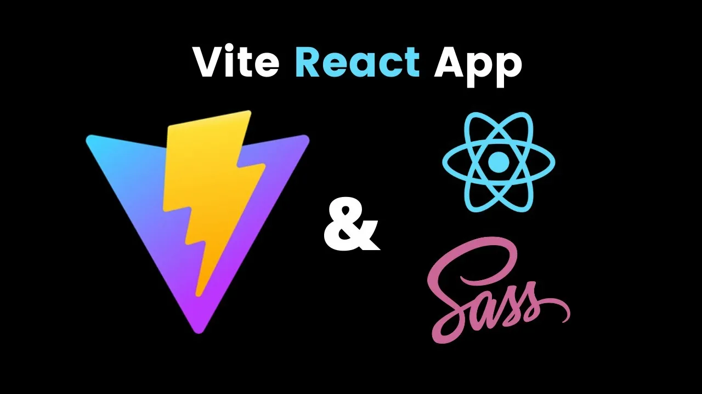
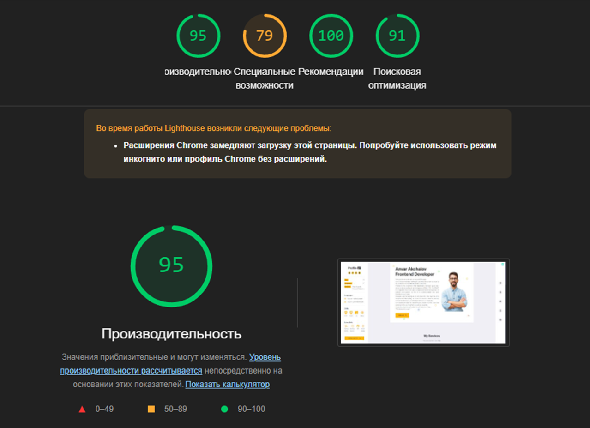

# Сайт-портфолио (React + Vite)

## Информация о проекте

Разработка фронтенд части вебсайта-портфолио с использованием фреймворка React. Сборка проекта осуществлялась с помощью Vite. Сайт развернут на сервере GitHub Pages, доступен по ссылке: [ссылка на сайт](https://anvarmgn.github.io/portfolio-website/ "перейти").

**Данный сайт служит платформой для демонстрации навыков и опыта разработчика.**

*Выполненные задачи:*
- Проанализировал существующие сайты-портфолио
- Спланировал структуру и дизайн
- Добавил в блок "Portfolio" учебный проект магазин одежды - Сlothing Store
- Использовал методологию БЭМ (для Clothing Store) при создании архитектуры сайта для упрощения работы с кодом
- Для ускорения работы со стилями использовал препроцессор SASS/SCSS
- Создал компоненты JSX
- В процессе работы с React использовал "хуки" useState, useEffect
- Добавил функциональность – возможность скачивания резюме
- Применил Redux для управления состоянием формы с контактными данными "Leave Your Info"
- Провёл аудит сайта с помощью Google Lighthouse

*Результат аудита Lighthouse:*


- Производительность – 95%
- Рекомендации – 100%
- Поисковая оптимизация – 91%
- Специальные возможности - 79%
---

## Иструкция по запуску

1. Склонировать репозиторий
```
git clone https://github.com/AnvarMGN/portfolio-website
```
2. Перейти в директорию проекта
```
cd portfolio-website
```
3. Установить необходимые зависимости node_modules
```
npm i
```
4. Запустить команду
```
npm run dev
```
5. Сайт откроется в браузере.

